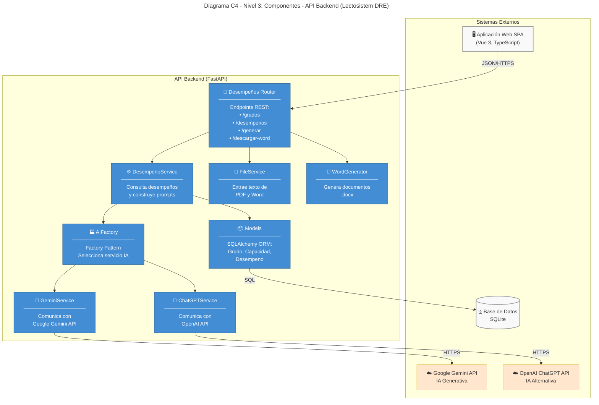

```mermaid
---
title: "Diagrama C4 - Nivel 3: Componentes - API Backend (Lectosistem DRE)"
---
flowchart TB
    subgraph ext["Sistemas Externos"]
        SPA["🖥️ Aplicación Web SPA\n(Vue 3, TypeScript)"]
        DB[("🗄️ Base de Datos\nSQLite")]
        GEMINI["☁️ Google Gemini API\nIA Generativa"]
        CHATGPT["☁️ OpenAI ChatGPT API\nIA Alternativa"]
    end

    subgraph api["API Backend (FastAPI)"]
        ROUTES["📡 Desempeños Router\n─────────────────\nEndpoints REST:\n• /grados\n• /desempenos\n• /generar\n• /descargar-word"]
        
        DESEMPENO_SVC["⚙️ DesempenoService\n─────────────────\nConsulta desempeños\ny construye prompts"]
        
        AI_FACTORY["🏭 AIFactory\n─────────────────\nFactory Pattern\nSelecciona servicio IA"]
        
        GEMINI_SVC["🤖 GeminiService\n─────────────────\nComunica con\nGoogle Gemini API"]
        
        CHATGPT_SVC["🤖 ChatGPTService\n─────────────────\nComunica con\nOpenAI API"]
        
        FILE_SVC["📁 FileService\n─────────────────\nExtrae texto de\nPDF y Word"]
        
        WORD_GEN["📄 WordGenerator\n─────────────────\nGenera documentos\n.docx"]
        
        MODELS["📦 Models\n─────────────────\nSQLAlchemy ORM:\nGrado, Capacidad,\nDesempeno"]
    end

    %% Relaciones
    SPA -->|"JSON/HTTPS"| ROUTES
    ROUTES --> DESEMPENO_SVC
    ROUTES --> FILE_SVC
    ROUTES --> WORD_GEN
    DESEMPENO_SVC --> AI_FACTORY
    DESEMPENO_SVC --> MODELS
    AI_FACTORY --> GEMINI_SVC
    AI_FACTORY --> CHATGPT_SVC
    GEMINI_SVC -->|"HTTPS"| GEMINI
    CHATGPT_SVC -->|"HTTPS"| CHATGPT
    MODELS -->|"SQL"| DB

    %% Estilos
    classDef external fill:#f9f9f9,stroke:#999,stroke-width:2px
    classDef component fill:#438DD5,stroke:#2E6295,color:#fff
    classDef service fill:#85BBF0,stroke:#5A9BD4,color:#000
    classDef database fill:#f5f5f5,stroke:#666
    classDef cloud fill:#FFE6CC,stroke:#D79B00

    class SPA,DB external
    class GEMINI,CHATGPT cloud
    class ROUTES,DESEMPENO_SVC,AI_FACTORY,GEMINI_SVC,CHATGPT_SVC,FILE_SVC,WORD_GEN,MODELS component
```
